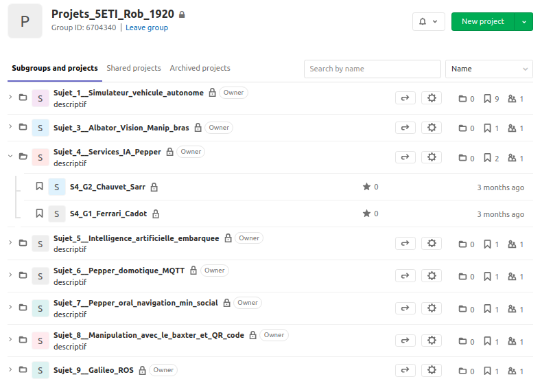
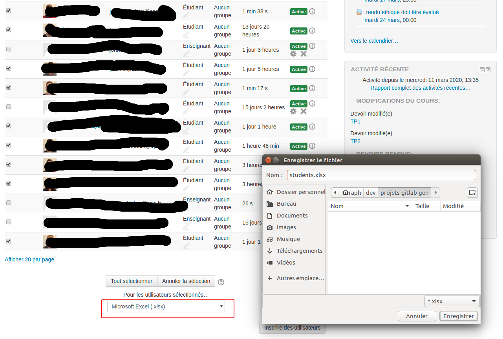

# Générateur de projets GitLab depuis une base d'élèves Moodle

Voici l'arborescence de projet que l'on peut générer avec les scripts de ce dépot. On observe ci-dessous: Un groupe module (ici Projets_5ETI_Rob_1920), autant de sous-groupes de sujets qu'on le souhaite, des projets pour chacun de ces sujets :  



Les dépots peuvent être privés (par défaut). Le prof voit tout et les étudiants n'ont accès qu'à leur propre projet ! :)

## Prérequis 
- python 3.6 ou + 
- Clone du présent dépot
- ```pip install requirements.txt``` (idéalement dans un virtualenv)
- Compte gitlab 
  - Créez un tocken dans `Settings`-->`Access Tokens`    
  - Dans le dépot créez un fichier `token.yaml` contenant la clef `token_gitlab` associée à la valeur de votre clef. 
  - ex : `token_gitlab: sdf4q56sd4f56s4dfq4sdf6sdf`
- Demander aux étudiants de créer un compte gitlab avec **leur email CPE**, ainsi que leur vrai nom et prénom et un pseudo au choix


## Récupérer les données élèves sur e-Campus
- Dans votre module sur e-Campus, allez dans `Participants`
- Triez par NOM
- Vous pouvez aussi filtrer pour n'avoir que les élèves (attention Marta a un compte élève...)
- Selectionnez les étudiants et téléchargez le fichier Excel `students.xlsx` tel que sur le screenshot ci-dessous  
  


## Complétion des données étudiantes

- Ajoutez à la suite, une colonne `Sujets` et une colonne `Teams`
- Dans la colonne `Sujet`, attribuez des numéros de sujet ( de 1 à +, sans saut)
- Dans la colonne `Teams`, attribuez des numéros pour chaque groupe de travail ( de 1 à + )

## Définition des sujets

Regardez le fichier `topics.yaml` et modifiez le. Gardez au moins un sujet. Les clefs des sujets doivent garder le format `Sujet_1`, `Sujet_2`, ..., `Sujet_n`

## Tester que les étudiants ont bien créer leur compte...
(si besoin, sourcez votre virtualenv)
Dans le repertoire du projet :
```python
python checkUsers.py
```
Les étudiants pas (ou mal) inscrits sont affichés en log sur fond rouge

## Générer le fichier des groupes d'étudiants

```bash
python eCampus2yaml.py #traitement de students.xlsx (par défaut)
```

ou 

```bash
python eCampus2yaml.py nom_de_votre_excel.xlsx
```

## Générer les groupes/projets sous GitLab

```bash
python createGitLabProjects.py #traitement de teams.yaml et topics.yaml (par défaut)
```
ou

```bash
python createGitLabProjects.py fichier_team_genere.yaml #et topics.yaml (par défaut)
```
ou

```bash
python createGitLabProjects.py fichier_team_genere.yaml fichier_sujets.yaml 
```

ou  

```bash
python createGitLabProjects.py fichier_team_genere.yaml fichier_sujets.yaml --only-group-number
```
`--only-group-number` doit être en 3ème argument. Si on a qu'un sujet, ça évite d'écrire S1 en préfix de chaque projet. Le projet commencera donc par le préfix de groupe G1, G2, ..., Gn

## Suivi d'activité des étudiants

Pour vérifier les commits par étudiants, par groupe :
```bash
python checkStudentActivity.py fichier_team_genere.yaml fichier_sujets.yaml 
```

**Et voilà ! :)**

